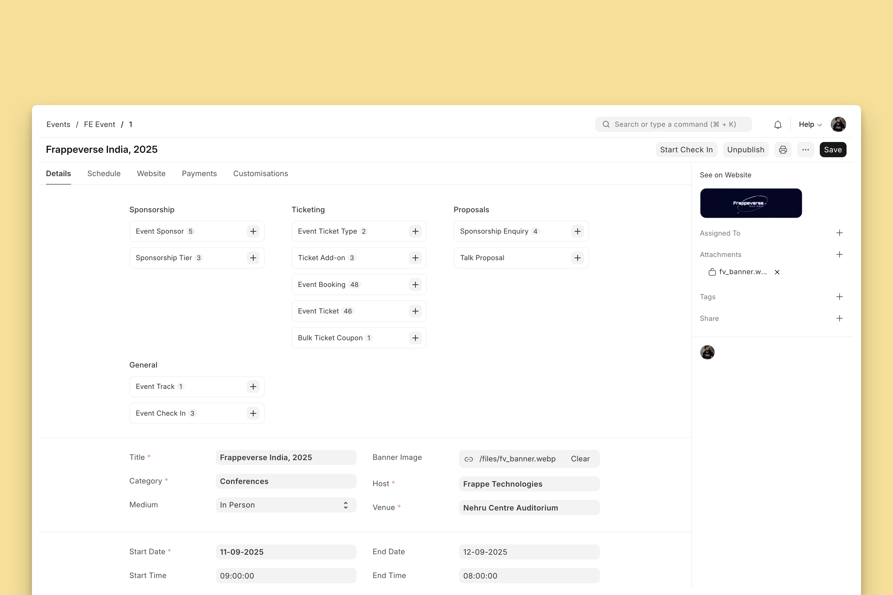
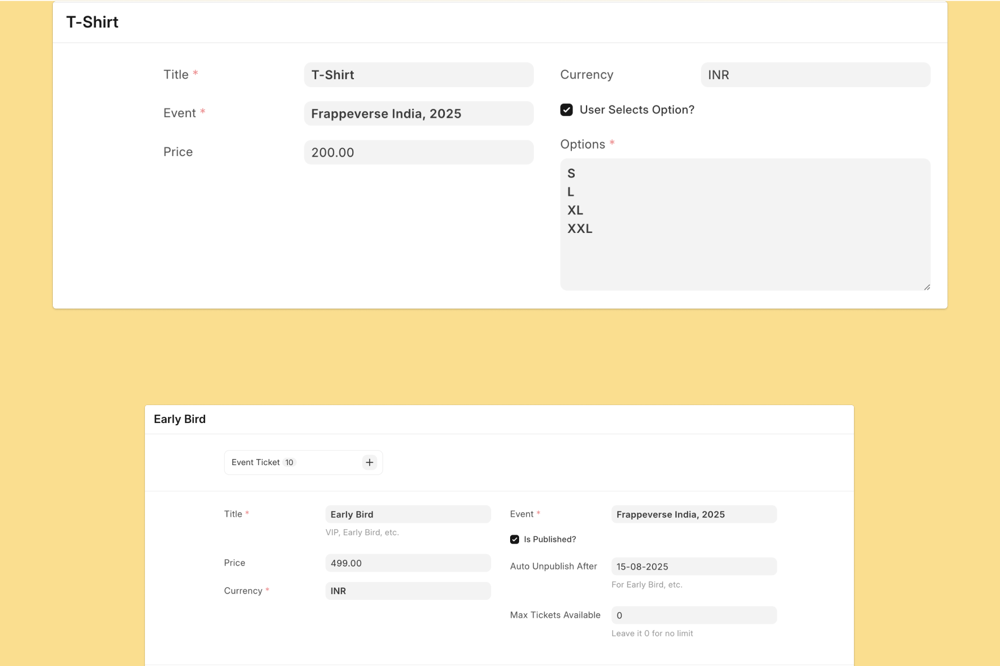
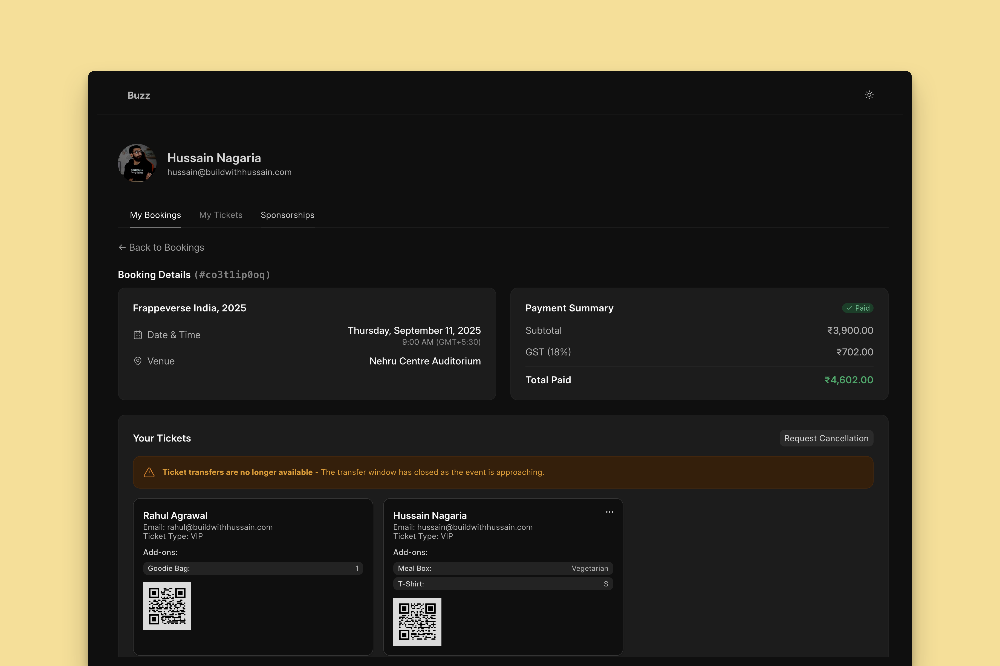
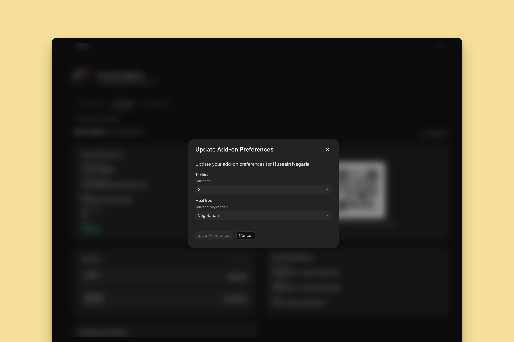
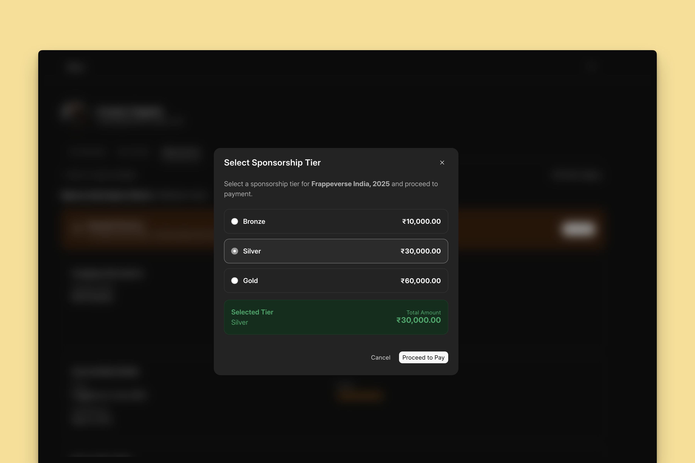

<div style="text-align: center;">
  <a href="https://github.com/BuildWithHussain/events/actions/workflows/ci.yml"></a>
  <a href="https://github.com/BuildWithHussain/events/stargazers"></a>
  <a href="https://www.gnu.org/licenses/agpl-3.0"></a>
  <a href="https://github.com/BuildWithHussain/events/commits/main"></a>
</div>



Open Source, Powerful, and Comprehensive Event Management Platform

### Stack / Architecture

1. Frappe Framework: The Backend and Admin Interface
2. FrappeUI (based on Vue & TailwindCSS): For the frontend dashboard (for attendee, sponsors, etc.)
3. Frappe Builder: For the public pages like events list and details page.

### The Main Entity

The **FE Event** DocType/Form is the primary entity of the system. Once you have created an event, you can setup ticket types, sponsorship tiers, add-ons (like T-Shirts, Meals, etc.), schedule, and much more!

### Features

This is not an exhaustive list by any means, just to give you an idea 😃

#### Dynamic Ticket & Add-on Types



#### The Booking Form

Once you have defined the proper ticket types, add-ons, and publish your event, the booking form will dynamically use it for booking.


#### Payments App Integration

This app depends on Frappe's Payments app for online payments. You can select a Payment Gateway in the event form. BTW GST collection is just a check-box away 😉

#### The Dashboard



#### Ticket Management

The benefits of having a "self-service" dashboard for attendees is that they can modify their bookings on their own (the deadlines can be configured from the **Event Management Settings**). For example, changing their T-Shirt Size after booking:



They can also transfer tickets or request for cancellation.

#### Sponsorship Management

Folks can enquire about sponsoring an event and upon approval from the event management team (from desk), they can directly pay from the dashboard too:



*As soon as they pay, their logo appears on the event page!*


### Installation

You can install this app using the [bench](https://github.com/frappe/bench) CLI:

```bash
cd $PATH_TO_YOUR_BENCH
bench get-app $URL_OF_THIS_REPO --branch main
bench install-app events
```

### Contributing

This app uses `pre-commit` for code formatting and linting. Please [install pre-commit](https://pre-commit.com/#installation) and enable it for this repository:

```bash
cd apps/events
pre-commit install
```

Pre-commit is configured to use the following tools for checking and formatting your code:

- ruff
- eslint
- prettier
- pyupgrade
### CI

This app can use GitHub Actions for CI. The following workflows are configured:

- CI: Installs this app and runs unit tests on every push to `develop` branch.
- Linters: Runs [Frappe Semgrep Rules](https://github.com/frappe/semgrep-rules) and [pip-audit](https://pypi.org/project/pip-audit/) on every pull request.


### License

agpl-3.0
